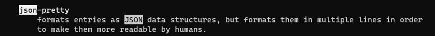

# Question 1

    sudo apt upgrade
    sudo apt update

# Question 2

used **r** to replace **eq -1** with **eq 0** 
used **:%s/eco/echo/g** to replace all instances of eco with echo 
used **/V** to search and replace capital v with capital C 
  

# Question 3

**-b** is used for the current boot 
 
**-p** 7 is used to show priority in the output logs 
 
**--output=json-pretty** is used for pretty json formatting 
 
 
Here is the final command 
 

# Question 4

    #!/bin/bash

    function allUsers(){
        echo "Regular users on the system are:"
        awk -F ':' '$3>=1000 && $3<=5000 {print ""$1" "$3" "$7}'  /etc/passwd

        echo "Users Currently logged in are:"
        who
    }
    allUsers
    allUsers > /etc/motd

# Question 5

    [Unit]
    Description=Run find User file to check all users

    [Service]
    Type=notify
    ExecStart=/usr/local/bin/find_users

    [install]
    WantedBy=multi-user.target
I put the service file in /etc/systemd/system

# Question 6
    [unit]
    Description= run Find_user after startup

    [Timer]
    OnBootSec=1min

    [Install]
    WantedBy=timers.target

 
                                                                   