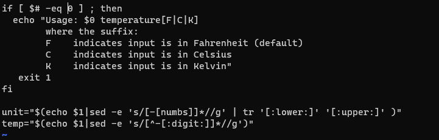

# Question 1

    sudo apt upgrade
    sudo apt update

# Question 2

used **r** to replace **eq -1** with **eq 0** 
used **:%s/eco/echo/g** to replace all instances of eco with echo 
used **/V** to search and replace capital v with capital C 
 

# Question 3
